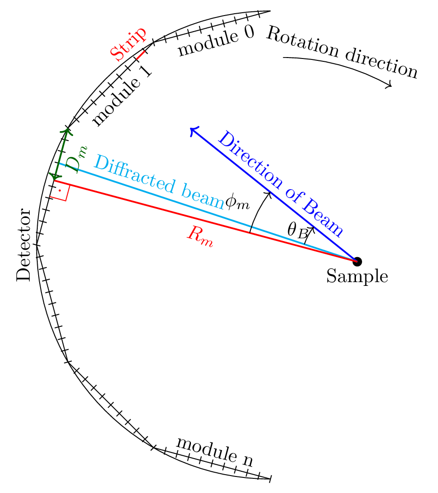
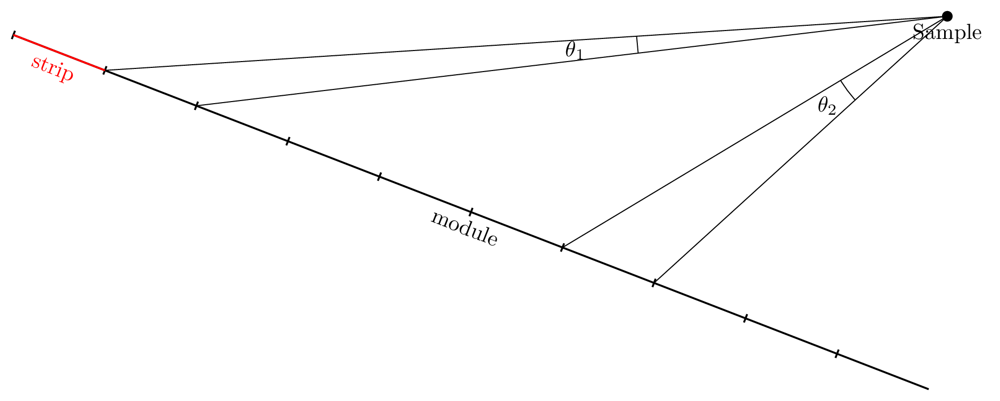

Theory
=======

.. role:: red
    :class: red

The Mythen Detector is used for powder diffraction experiments. In powder diffraction experiments the sample's diffraction pattern is measured. Based on Bragg's Law :eq:`eq:braggslaw` the material (crystaline) structure can be reconstructed.

.. math:: 
    :label: eq:braggslaw

    2*\theta_{B} = 2*\arcsin\left(\frac{n\lambda}{2q}\right), 

where :math:`\theta_{B}` is the diffraction angle, :math:`\lambda` the wavelength of the laser beam, :math:`n` the diffraction order and :math:`q` the grating constant of the crystal. 

..
    maybe add example of diffraction pattern measured with mythen 

.. 
    is there a difference between intensity spectrum and diffraction pattern? 

.. 
    why are these gaussian like curves and not one signal - charge sharing? - error

One can use simple trigonometric relations to deduce the diffraction angle :math:`\theta_{B}` from the geometric parameters of the detector such as the detector position relative to the sample and the intrinsic detector parameters (e.g. chip width, chip arrangement). 
The diffraction angle is thus a function of the strip/chip index and the detector geometric's parameter :math:`\sum`. An example of possible detector parameters is shown in :numref:`detectorsetup`. 

.. math:: 
    
    \theta_B = f_{\sum}\left(\textrm{strip_index}\right)

A schemantic representation of Mythen's detector setup is shown in :numref:`detectorsetup`. The Mythen detector consists of multiple modules arranged in a circular fashion. 
Each module consists of 1280 chips commonly referred to as strips or channels. Each strip has a width of 0.05 mm also referred to as pitch. 
The detector can be rotated around the sample. Note that the rotation trajectory is generally not equivalent to the detector's circumference. 

.. _detectorsetup:

    Schemantic representation of Mythen detector setup. The diffraction angle :math:`\theta_B` depends on the three geometric parameters :math:`R`, :math:`D` and :math:`\phi`. 

In :numref:`detectorsetup` the parameter :math:`R_m` represents the ortogonal sample projection onto the module plane, parameter :math:`D_m` represents the distance of the first chip within the module to the sample projection and :math:`\theta_m` represents the angle between the orthogonal sample projection and the direction of the laser beam. 
Note that these parameters differ for each module but are rotation invariant for rotations around the sample :math:`S`. 
Using the above mentioned parameters :math:`\sum`, also referred to as module parameters, the diffraction angle can be calculated as follows: 

.. math:: 

    \theta_B = \phi_m - \arctan\left(\frac{D_m - \textrm{strip_index} * p}{R_m}\right), 

.. 
    mention reverse order 

where p denotes the pitch (internal detector parameter) and :math:`\textrm{strip_index} \in \{0,1,\cdots,1280\}`. 
Note that there are many more parameter sets to calculate the diffraction angle from. See section for an overview of common parameter sets. 

.. 
    How are the initial parameters known? Geometric measurements deduced from one measured diffraction pattern and theoretical diffraction pattern 

However, due to sample displacement, error in wavelength and zero offset the measured diffraction pattern is prone to errors. The detector's module parameters are thus slightly off and need to be calibrated for each module seperately. 

.. 
    mmh but these are fixed error's in measurement - its the same for each module and we can correct them if we know the sample displacement and the error in beam direction 
    - need to convert to the measured diffraction angle - were do we get these parameters what are error sources? 

Calculating the Diffraction Pattern from the Raw Intensity Spectrum
---------------------------------------------------------------------

Raw Photon Count Correction
^^^^^^^^^^^^^^^^^^^^^^^^^^^^

**Normalizing Distribution:**

Note that the photon counts are Poisson distributed. We thus apply Mighell's statistics to later use the Pearson :math:`\chi²` goodness-of-fit criterion: 

.. math:: 

    I = I + \min(I, 1) 

The photon counts are now normal distributed. Note, as one almost never has photon counts smaller than 1 or if so, one detects them as a bad channel the variance and expected value simplifies to :math:`\sigma² = I + 1` and :math:`\mu = I + 1`. See Section :ref:`pearsonchisquare` for more details on the Pearson :math:`\chi²` goodness-of-fit criterion: 

Further the raw normalized photon counts are corrected as follows: 

**Rate Correction:**
First the raw photon counts are rate corrected by the exposure rate. When several photons are captured by the same chip within the same exposure time only one photon is counted. The rate corrected photon counts :math:`Ì_{rc}` are given by: 

 
Dont know what it should do.

**Incident Intensity Correction:** 

The photon counts are corrected by the theoretical incident intensity :math:`I_{0}`. The incident intensity is the theoretical intensity of the laser beam.
.. mmh its actually something else dont get it is it fixed or per pixel? 

.. math:: 
    I_{I_0,corr} = I * \frac{1}{I_0} 

Dont know if this is correct.

**Solid Angle correction:** 

Don't know what this is. Something to do with actual illuminated surface (transverse width of beam). Pixel height. 

**Flatfield Correction:** 

The photon counts are corrected by the flatfield values :math:`F`: 

.. math:: 
    I_{f, corr} = \frac{I}{F} 

The corrected photon counts :math:`I_{corr}` are thus: 

.. math::
    I_{corr} = (I + 1) * c, 

where :math:`c` is the product of all correction factors:

.. math:: 
    c = \frac{1}{I_0} * \frac{1}{F}. 

Note that the variance and expected value then results to :math:`\sigma_{corr}² = c*I_{corr}` and :math:`\mu_{corr} = I_{corr}`. `

MMh i dont know if the correction coefficient's are constants or also probablistic variables. - The flatfield for sure is. 

Conversion to fixed angular strip widths
^^^^^^^^^^^^^^^^^^^^^^^^^^^^^^^^^^^^^^^^^
Based on the module's parameters one can now convert the strip index to the diffraction angle. 
However, depending on the location of the strip one strip can cover a larger angular region than others. See :numref:`angularstripwidth`. 
Additionally the angular width of a strip can be quite large. 
Thus, to get a more fine grained diffraction pattern we redistribute the photon intensity per strip 
to small resolution histogram bins covering a fixed angle. 

.. _angularstripwidth:

    Depending on the strip position relative to the sample the covered strip angle is much larger :math:`\theta_2 > \theta_1`. 

The redistributed photon intensity :math:`I_{red, i}` at bin :math:`i` is given by: 

.. math:: 

    I_{red, i} = I_{corr}*\frac{w_{bin}}{w_{strip}}, 

.. 
    oke its actually not multiplied with c_bin 
    maybe better: 
    .. math:: 
        I_{red, i} = \sum_{strip\_index \in {strip\_indices covering bin i} (I_{fcorr}(strip\_index) + 1)*\frac{w_{bin}}{w_{strip}(strip\_index)}*c_{bin}, 

where :math:`I_{corr}` are the corrected photon counts, 
:math:`w_{bin}` is the histogram bin width denoted as an angle 
and :math:`w_{strip}` the strip width denoted in angles. 

The strip width :math:`w_{strip}` for strip width index :math:`si` is given as the difference in diffraction angle of the 
strip's start :math:`\theta_{B_{si - 0.5}}` and endpoint :math:`\theta_{B_{si + 0.5}}`: 

.. math:: 
    
    \begin{align}
    w_{strip}(si) &= \phi_m - \arctan\left(\frac{D_m - (si + 0.5) * p}{R_m}\right) - \left(\phi_m - \arctan\left(\frac{D_m - (si - 0.5) * p}{R_m}\right)\right) \\ 
              &= \arctan\left(\frac{D_m - (si - 0.5) * p}{R_m}\right) - \arctan\left(\frac{D_m - (si + 0.5) * p}{R_m}\right)
    \end{align}
.. 
    what if the strip width is smaller than the bin - wrong photon counts 

Note that several strip widths might overlap with one bin. Nor might a strip cover the entire bin. We thus use the weighted average of all the corrected photon counts of strip's :math:`T`, where the strip overlaps with the bin: 

.. math:: 

    T = \left\{si \in \{0, \dots, 1279\} | \left[\theta_{B_{si- 0.5}}, \theta_{B_{si + 0.5}}\right] \cap \left[(i - 0.5)*w_{bin}, (i + 0.5)*w_{bin}\right] \neq \emptyset \right\}

The weighted average is then given by: 

.. math:: 

    I_{red, i} = \sum_{si \in T} \alpha'_{si, i} * I_{corr}(si), 
    
where the normalized statistical weights :math:`\alpha'_{strip\_index}` are given by: 

.. math::

    \alpha'_{si, i} = \frac{c_{si,i} * \sigma_{corr}^{-2}(si)}{\sum_{si \in T} c_{si,i} * \sigma_{corr}^{-2}(si)}.
    

The parameter :math:`c_{si, bin}` denotes the bin coverage factor e.g. how much of the bin is covered by the strip: 

.. math:: 

    c_{si, i} = \frac{\min(\theta_{B_{si + 0.5}}, (i + 0.5)*w_{bin}) 
 - \max(\theta_{B_{si - 0.5}}, (i - 0.5)*w_{bin}) }{w_{bin}}. 

The resulting variance for the redistributed photon counts is then given by: 

.. math:: 

    \sigma_{red, i}² = \sum_{si \in T} (\alpha'_{si, i})^{2} * \sigma_{corr}^{2}(si).

Parameter Calibration
----------------------

In order to calibrate the module's parameters we choose one of the peaks 
in the diffraction pattern, also referred to as base peak. The base peak is denoted by the peak's central diffraction angle :math:`\alpha`. 
We take several acquisition's of the same sample however with slightly shifted detector position. We shift the detector position by rotating the detector around the sample. 
Remember that the module's parameters are rotation invariant. 
In theory this results in the same diffraction pattern as well as the same base peak just
shifted by the rotation angle, in practice the diffraction patterns are slightly off. 
We thus minimize the :math:`\chi²`-similarity of the shifted acquired base peaks within one module to get the optimal parameters for each module.
 
.. 
    add a figure of overlapping base peak angles, e.g. selected base peak of diffraction angle

To choose the base peak one can either use a tabulated Bragg's angle 
known by the theoretical structure of the sample or qualitatively select 
a base peak in the measured diffraction pattern. 
Note that by rotating the detector around the sample the base peak 
should be measured by each module multiple times. 
However, the rotation range is limited by the detector setup and the 
angular range is usually much smaller than :math:`[-180^{\circ}, 180^{\circ}]`. 
Therefore, choose a base peak angle that can be measured by all modules and is 
well within the detector rotation range. 

.. 
    Is the measurement error prone or only the conversion 
    How to work with errors in measurements 

.. _pearsonchisquare:

:math:`\chi²`- similarity criterion 
^^^^^^^^^^^^^^^^^^^^^^^^^^^^^^^^^^^^

Let :math:`ROI_{\alpha} = \{ \{I_{red,0}, \sigma_{red,0}², \cdots , \{I_{red,N}, \sigma_{red,N}² \} \}` 
denote redistributed photon intensities within the base peak region 
of interest, where :math:`N` is the number of bins covered by the 
base peak region. With M acquisition's we have :math:`M`` regions of interests. 

We now want to minimize the Neyman (variance-weighted) :math:`\chi²`-similarity criterion: 

.. math:: 

    \chi_{k}² = \sum_{j=1}^M \frac{(I_{red, k, j} - \mathbb{E}_{k}(\sum))²}{\sigma_{k}^{2}(\sum)}, 

where :math:`\sigma_{k}^{2}(\sum)` and :math:`\mathbb{E}_{k}(\sum)` denote the variance and expected value for the bin :math:`k` using the module parameters :math:`\sum`.
With the module's parameter set :math:`R`, :math:`D` and :math:`\phi` these are: 

.. math:: 

    \sigma_{k}^{2}(R, D, \phi) = \sigma_{red, k,j}^{2} 

MMh im confused - the observed values also depend on the module parameters. 
Also why isnt it a fixed variance expecting for bin k? 

The expected value which minimizes the :math:`\chi²`-similarity criterion is given by the weighted average of all observed values:

.. math:: 
    
    a_{min,k} = \mathbb{E}_{k}(R, D, \phi) = \frac{\sum_{j=1}^M I_{red, k, j} * \sigma_{red, k, j}^{-2}}{\sum_{j=1}^M \sigma_{red, k, j}^{-2}}.

and resulting variance: 

.. math:: 

    \sigma_{a_{min,k}} = \frac{1}{\sum_{j=1}^{M} sigma_{red,k,j}^{- 2}}. 

The average :math:`chi_k^{2}|a_{min,k}` is then given by the average residual :math:`av\_res_{k}`: 

.. math:: 

    av\_res_{k} = \sqrt{\frac{1}{M-1} * \chi_k^{2}|a_{min,k}} = \sqrt{\frac{1}{M - 1}*(S_{2,k} -S_{1,k}*S_{0,k}^{-1})}, 

with: 

.. math:: 
    S_{p,k} = \sum_{j=1}^M I_{red, k, j}^{p} * \sigma_{red, k, j}^{-2}

We then scale the variance \sigma_{a_{min,k}} by the average residual. The scaled variances are then summed up for each bin within the base peak region. 

We then get the similarity criterion for different base peak regions:

.. math:: 

    \sum_{k=1}^{N} av\_res_{k} * \sigma_{a_{min,k}}. 

The goal is to minimize this similarity criterion based on the module parameters :math:`\sum`.

